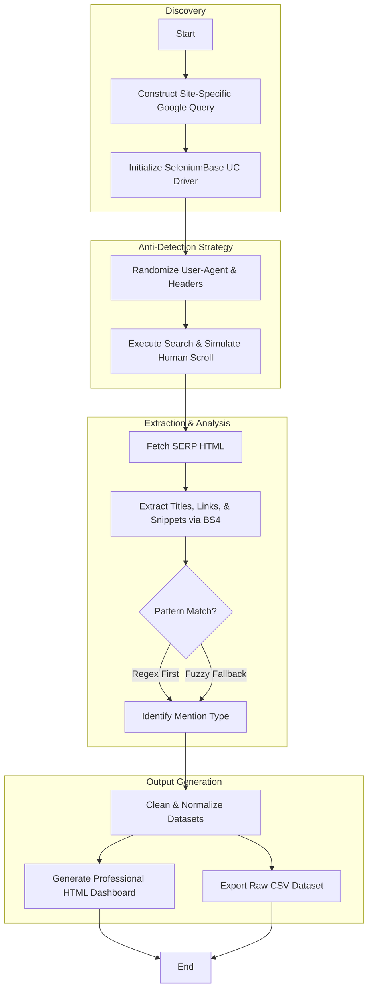

# 🏗️ Technical Architecture: LinkedIn Mentions Scraper

This document provides a deep-dive into the engineering design, data pipeline, and security mechanisms of the LinkedIn Mentions Scraper.

---

## 🧩 System Overview

The scraper is an intelligence-gathering tool that leverages **Google Search Indexing** as a broker to discover LinkedIn content. This approach bypasses the limitations of LinkedIn's internal search (which often throttles or restricts results based on network degree) and ensures a high discovery rate for public-facing executive and corporate content.

### Core Architecture Layers

1.  **Orchestration Layer (`SeleniumBase`)**: 
    - Manages the headless/headed browser lifecycle.
    - Implements the **Undetected-Chromedriver (UC)** protocol to bypass common automation detection signatures.
2.  **Anti-Detection Engine**: 
    - **Jitter Logic**: Adaptive sleep times between requests.
    - **Behavioral Simulation**: Randomized scrolling and variable-speed DOM interactions.
    - **Stealth Profiles**: Custom User-Agent cycling and CDP (Chrome DevTools Protocol) fingerprint masking.
3.  **Extraction & Parsing Pipeline**:
    - **Discovery**: Google Search query optimization (`site:linkedin.com "query"`).
    - **Normalization**: `BeautifulSoup4` extracts raw text and metadata from Search Result Pages (SERPs).
4.  **Intelligence & Filtering (`Pandas` + `RapidFuzz`)**:
    - **Primary Filter**: Regex-based target identification.
    - **Fuzzy Fallback**: Partial ratio matching to recover mentions obscured by OCR errors or layout snippets.

---

## 🔄 Data Flow

---

## 🛠️ Technical Specifications

### Anti-Bot Implementation
To avoid Google's aggressive bot detection, the intelligence engine implements:
- **Stealth Initialization**: Disables `navigator.webdriver` flags.
- **Adaptive Delays**: Instead of static `time.sleep()`, the tool uses `random.uniform(5, 10)` for page-level navigation and micro-pauses for element interaction.
- **Scroll Jitter**: Mimics human reading by scrolling in random increments with varying durations.

### Data Categorization Logic
The scraper classifies mentions into three distinct priority levels:
1.  **Joint Mention**: Both primary (e.g., Founder) and secondary (e.g., Company) entities found in the same context.
2.  **Individual Mentions**: Only one entity identified.
3.  **Fuzzy Recovery**: Mentions that would be missed by literal string matching but are relevant based on a Partial Ratio score > 85.

---

## 📋 Technology Stack

- **Runtime**: Python 3.10+
- **Automation**: [SeleniumBase](https://github.com/seleniumbase/SeleniumBase) (UC Mode)
- **Parsing**: [BeautifulSoup4](https://www.crummy.com/software/BeautifulSoup/)
- **Intelligence**: [RapidFuzz](https://github.com/maxbachmann/RapidFuzz)
- **Data Science**: [Pandas](https://pandas.pydata.org/)
